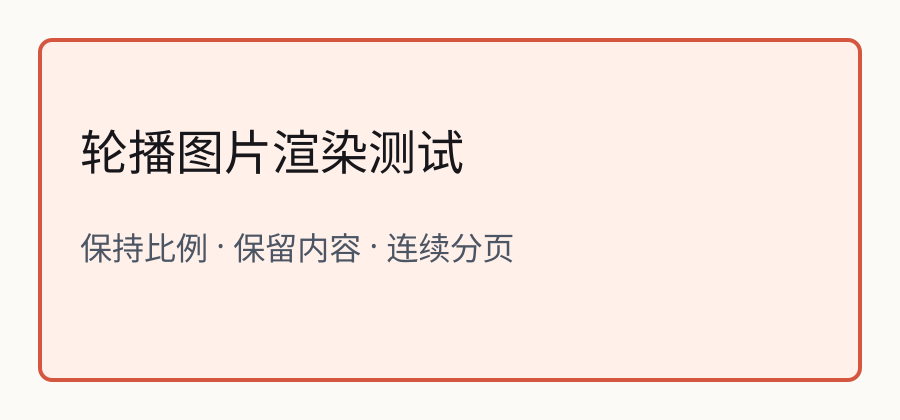

这是一篇固定的测试文章。**重点文字**只加粗，<mark>显式高亮</mark>单独显示。

## 阅读结构

### 连续的章节标题

父标题和子标题需要与正文连续阅读，不能把父标题单独留在上一页。

第一行明确换行。\
第二行保留换行。

> 引用仍属于正文的连续排版。

1. 保留列表编号。
2. 保留图片顺序及比例。



*图片说明与图片保持对应。*

## 代码与表格

```ts
const pages = 18;
```

| 检查项 | 预期 |
| --- | --- |
| 页数 | 含封面最多 18 张 |
| 内容 | 文字及图片完整保留 |

正文读完自然结束。
